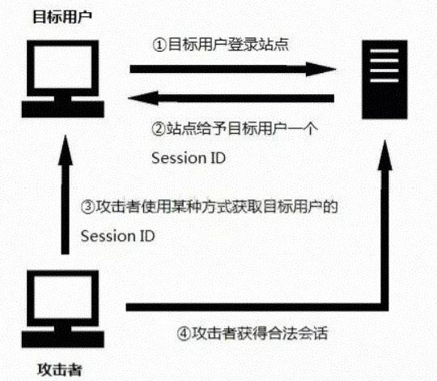
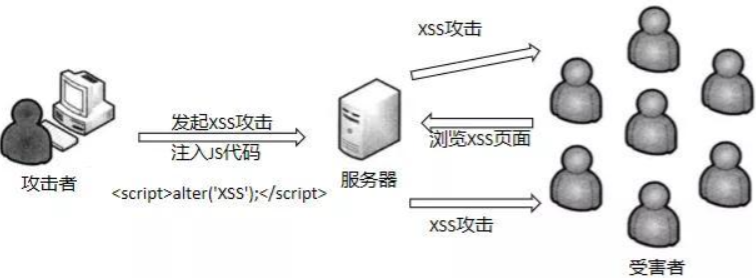
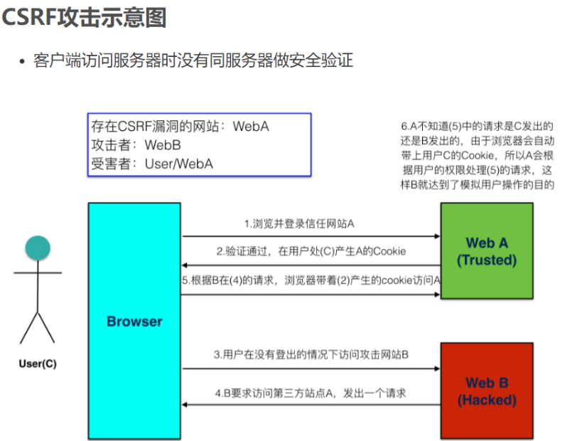
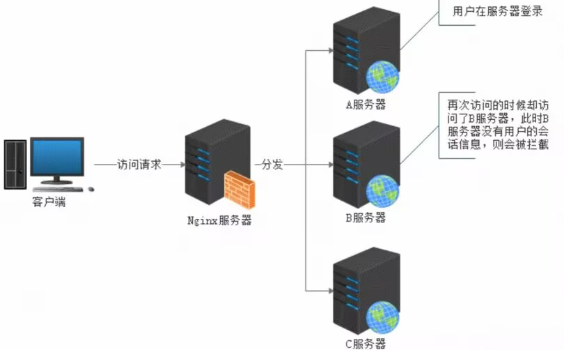
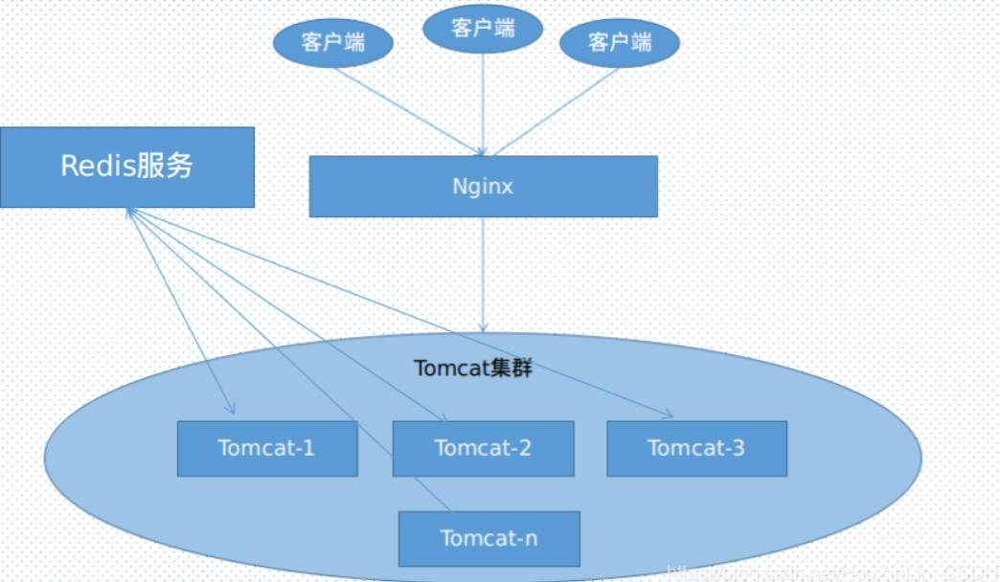
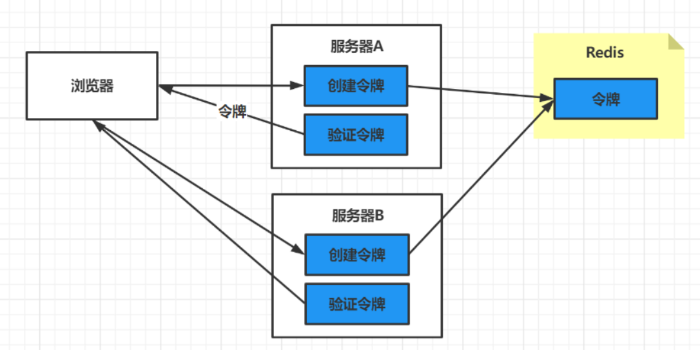

# 作业

## 1. 会话安全性

### ● 会话劫持和防御

会话劫持（Session Hijacking），也称为Cookie劫持，是一种网络攻击手段，攻击者通过获取用户的会话ID（通常存储在Cookie中）来接管用户的会话，从而冒充用户身份进行非法操作。这种攻击通常发生在用户登录网站后，攻击者通过各种手段获取用户的会话ID，然后利用这个ID来访问用户的账户，进行未授权的活动。

查找到易于理解的图片：



**会话劫持的常见方式包括**：

1. 跨站脚本攻击（XSS）：攻击者在网页中注入恶意脚本，当用户访问该页面时，脚本会窃取用户的会话Cookie。
2. 会话侧劫持（Session Sidejacking）：攻击者通过数据包嗅探工具监控网络流量，从而获取会话Cookie。
3. 会话固定（Session Fixation）：攻击者迫使用户使用一个固定的会话ID，然后攻击者利用这个ID来劫持会话。
4. 恶意软件：通过木马等恶意程序，攻击者可以窃取用户计算机上的Cookie。

**防御会话劫持的措施**：

1. 使用HTTPS：确保所有数据传输都通过HTTPS进行加密，以防止中间人攻击。
2. 设置HttpOnly属性：在Cookie中设置HttpOnly属性，防止JavaScript脚本访问Cookie，从而减少XSS攻击的风险。
3. 使用安全的Cookie标志：设置Secure和HttpOnly属性，确保Cookie只能通过安全的HTTPS协议传输，并且无法被JavaScript访问。
4. 限制Cookie的路径和域名：只将Cookie设置为当前路径和域名下使用，避免不必要的路径和域名下的应用程序访问和利用。
5. 定期更换Session ID：通过定期更换Session ID，降低Cookie被劫持后长期利用的风险。
6. 加强输入验证和过滤：对用户输入的数据进行严格的验证和过滤，防止恶意代码注入和XSS攻击。

### ● 跨站脚本攻击（XSS）和防御

跨站脚本攻击（Cross-Site Scripting，简称XSS）是一种网络安全漏洞，它允许攻击者将恶意脚本注入到网页中，这些脚本在其他用户的浏览器上执行时，可以窃取用户的敏感信息、冒充用户身份、篡改网页内容或进行其他恶意操作。

查找到易于理解的图片：



**XSS攻击的类型**：

1. 存储型XSS：攻击者的脚本存储在目标网站的数据库中，当用户浏览网站时，脚本作为正常内容被加载并执行。
2. 反射型XSS：攻击者的脚本不存储在网站中，而是通过诱使用户点击一个链接，将恶意脚本作为请求的一部分发送到服务器，然后服务器将恶意脚本反射回用户的浏览器中执行。
3. 基于DOM的XSS：攻击者的脚本不经过服务器，而是在客户端执行。当网页的JavaScript代码错误地使用了用户输入的数据，并且这些数据被插入到DOM中时，就会发生这种类型的XSS。

**防御XSS攻击的策略**：

1. 输入验证：对所有用户输入进行严格验证，确保只接受符合特定模式的输入，拒绝或过滤掉潜在危险的字符。
2. 输出编码：在将用户输入的数据输出到页面之前，对其进行适当的编码，以确保浏览器将其作为文本处理，而不是脚本。
3. 使用HTTP头部：
   * 设置`Content-Security-Policy`（CSP）头部，限制网页可以执行的脚本和加载的资源。
   * 使用`X-XSS-Protection`头部启用浏览器内置的XSS过滤机制。
4. 使用安全库和框架：使用现代Web开发框架，这些框架通常内置了防御XSS的功能。
5. 定期审计与测试：进行代码审查和安全测试，以发现和修复潜在的XSS漏洞。
6. 教育与培训：对开发人员进行安全编码的培训，提高他们对XSS攻击的认识和防范能力。
7. 安全配置：
   * 设置`HttpOnly`标志在Cookie上，防止JavaScript访问敏感Cookie。
   * 使用`Secure`标志确保Cookie仅通过HTTPS传输。
8. 避免内联脚本：尽量避免在HTML中内联JavaScript代码，而是使用外部脚本文件。
9. 使用Web应用防火墙（WAF）：部署WAF可以帮助识别和阻止XSS攻击。
10. 多层防御：实施多层防御策略，即使攻击者绕过了一层防御，还有其他防线可以防止攻击成功。

### ● 跨站请求伪造（CSRF）和防御

跨站请求伪造（CSRF，Cross-site request forgery）是一种网络攻击技术，它利用用户对网站的认证信息，诱骗用户的浏览器去访问一个自己以前认证过的网站并执行一些操作，例如以用户的名义发送邮件、发消息、甚至财产操作如转账和购买商品等。

查找到的易于理解的图片：



**CSRF攻击的常见类型**：

1. GET类型CSRF：攻击者通过构造一个链接，当用户点击这个链接时，浏览器会向攻击者指定的地址发送带有用户登录信息的GET请求。
2. POST类型CSRF：攻击者通过自动提交的表单，模拟用户在网站的POST请求，执行如转账等敏感操作。
3. 基于DOM的CSRF：攻击者利用网站客户端脚本的漏洞，通过恶意网站修改用户在其他标签页中运行的DOM，从而在用户不知情的情况下发起请求。

**CSRF攻击的防御措施**：

1. 使用验证码：在执行敏感操作时要求用户输入验证码，确保操作是用户主动执行的。
2. Token验证：服务器生成一个随机的Token，并在表单提交时验证这个Token，确保请求是由用户主动发起的。
3. Referer检查：服务器检查HTTP请求头中的Referer字段，确认请求是否来自合法的页面。
4. SameSite Cookie属性：设置Cookie的SameSite属性为Strict或Lax，限制第三方Cookie的发送。
5. 使用安全的HTTP方法：确保敏感操作只通过POST请求进行，避免使用GET请求执行敏感操作。
6. 用户教育：提高用户对CSRF攻击的认识，教育他们不要点击不明链接或下载未知来源的文件。

## 2. 分布式会话管理

### ● 分布式环境下的会话同步问题

在分布式环境下，会话同步问题是一个常见的挑战。由于HTTP协议本身是无状态的，服务器无法识别不同请求是否来自同一个用户，因此需要通过会话（Session）来跟踪用户的状态。在单机环境中，Session的管理相对简单，但当应用部署在多台服务器上时，如何保持用户Session的一致性就成了一个问题。

分布式环境下的会话同步问题主要表现在以下几个方面：

1. Session 复制：在多台服务器之间同步Session信息，使得任何一台服务器都能够访问到用户的Session数据。这种方法的优点是实现简单，但缺点是会占用较多的网络带宽，并且可能会因为同步延迟导致数据不一致的问题。
2. Session 绑定：通过负载均衡器（如Nginx）的配置，确保同一个用户的请求总是被分配到同一台服务器上。这种方法可以避免Session同步的问题，但缺点是如果服务器宕机，会导致Session数据丢失，且不支持负载均衡。
3. 客户端存储：将Session数据加密后存储在客户端的Cookie中。这种方法的优点是简单且不依赖服务器的Session存储，但缺点是Cookie大小有限，不适合存储大量数据，且安全性较低。
4. 统一存储：将Session数据存储在中央存储系统中，如Redis或Memcached。所有服务器都从这个中央存储系统中读取和写入Session数据。这种方法的优点是可以实现Session数据的高可用性和一致性，但缺点是需要额外的存储系统，并且可能会增加网络延迟。
5. Spring Session：Spring框架提供了Spring Session项目，可以与Redis等后端存储集成，实现分布式会话管理。这种方法的优点是无侵入性，配置简单，且可以无缝整合到Spring应用中。
6. 数据库存储：将Session数据存储在数据库中，这种方式可以实现Session数据的持久化，但可能会因为数据库的性能瓶颈而影响Session的读写速度。
7. Token机制：使用JWT（JSON Web Token）等Token机制来代替Session，Token中包含了用户的身份信息，服务器不需要存储Session数据。这种方法的优点是可以实现跨服务的Session共享，但缺点是需要在客户端和服务器之间传递Token，且需要妥善处理Token的安全性问题。

查找到的易于理解的图片：



### ● Session集群解决方案

Session集群解决方案是指在分布式系统中，为了保持用户会话的一致性和连续性，而采取的一系列技术手段。

以下是几种常见的Session集群解决方案：

1. Session复制：通过在多个服务器之间同步Session信息，使得任何一台服务器都能够访问到用户的Session数据。这种方式的优点是实现简单，但缺点是同步过程复杂，可能会造成同步延迟，且数据量受内存限制 。
2. Session绑定：使用负载均衡器（如Nginx）的配置，确保同一个用户的请求总是被分配到同一台服务器上。这种方式可以避免Session同步的问题，但缺点是如果服务器宕机，会导致Session数据丢失，且不支持负载均衡 。
3. 客户端存储：将Session数据加密后存储在客户端的Cookie中。这种方式的优点是简单易实现，缺点是Cookie的存储容量较小，且安全性较低 。
4. 统一存储：将Session数据存储在中央存储系统中，如Redis或Memcached。所有服务器都从这个中央存储系统中读取和写入Session数据。这种方式的优点是可以实现Session数据的高可用性和一致性，但缺点是需要额外的存储系统，并且可能会增加网络延迟 。
5. Spring Session：Spring框架提供了Spring Session项目，可以与Redis等后端存储集成，实现分布式会话管理。这种方式的优点是无侵入性，配置简单，且可以无缝整合到Spring应用中 。
6. 数据库存储：将Session数据存储在数据库中，这种方式可以实现Session数据的持久化，但可能会因为数据库的性能瓶颈而影响Session的读写速度。
7. Token机制：使用JWT（JSON Web Token）等Token机制来代替Session，Token中包含了用户的身份信息，服务器不需要存储Session数据。这种方式的优点是可以实现跨服务的Session共享，但缺点是需要在客户端和服务器之间传递Token，且需要妥善处理Token的安全性问题。

查找到的易于理解的图片：



### ● 使用Redis等缓存技术实现分布式会话

使用Redis等缓存技术实现分布式会话是一种常见的解决方案，主要目的是在多台服务器之间共享用户的会话数据。这种方式可以解决传统单体应用中会话数据无法在多个实例间共享的问题，从而提高系统的可扩展性和可用性。

在分布式系统中，当应用被部署在多台服务器上时，用户的会话信息需要在服务器之间共享，以便用户在不同服务器上都能保持登录状态和会话数据的一致性。使用Redis作为分布式会话的存储，可以通过以下方式实现：
1. 集中式存储：将用户的会话数据存储在Redis缓存中，而不是存储在单个服务器的内存里。这样，任何服务器实例都可以访问和修改用户的会话数据，因为它们都是从同一个地方获取数据。
2. Spring Session集成：使用Spring Session项目，它可以与Redis等后端存储集成，实现分布式会话管理。Spring Session提供了对用户会话管理的一系列API和实现，支持集群Session功能，默认采用外置的Redis来存储Session数据，以此来解决Session共享的问题。
3. Session持久化：Redis支持多种数据类型和持久化方式，可以将Session数据以适合的数据类型存储，并配置持久化策略以防止数据丢失。
4. 会话超时和事件通知：Redis可以设置键的过期时间来控制会话的超时，并且通过配置keyspace notifications来监听会话的过期和删除事件，以便应用程序可以做出相应的处理。
5. 高可用性和扩展性：通过Redis的复制和Sentinel或Cluster功能，可以构建高可用的分布式会话存储，确保会话数据不会因为单点故障而丢失，并且可以根据需要进行水平扩展。
6. 安全性：虽然Redis提供了数据加密传输的选项，但是存储在Redis中的会话数据应该是经过加密的，以防止敏感信息泄露。

查找到的易于理解的图片：



## 3. 会话状态的序列化和反序列化

### ● 会话状态的序列化和反序列化

会话状态的序列化和反序列化是计算机科学中处理数据存储和传输的两个重要概念，尤其在网络编程和分布式系统中非常常见。下面分别解释这两个概念：

1. **序列化（Serialization）**：
   * 定义：序列化是将数据结构或对象状态转换成可存储或可传输的格式的过程。这种格式通常是字节流或字符串，可以保存到文件、数据库或通过网络发送。
   * 目的：序列化的主要目的是能够将内存中的对象状态持久化存储，或者在不同的系统或程序之间传输对象状态。
   * 应用场景：
     * 持久化存储：比如将用户会话信息存储到数据库中。
     * 网络通信：在分布式系统中，服务之间需要通过网络传输对象数据。
   * 技术实现：序列化可以通过各种编程语言提供的库来实现，如Java的`Serializable`接口，Python的`pickle`模块等。
2. **反序列化（Deserialization）**：
   * 定义：反序列化是序列化的逆过程，它将序列化后的数据（如字节流或字符串）转换回原始的数据结构或对象状态。
   * 目的：反序列化的主要目的是恢复之前序列化的数据，以便程序可以继续使用这些数据。
   * 应用场景：
     * 数据恢复：从数据库或文件中读取序列化的数据，并恢复成内存中的对象。
     * 网络通信：接收到序列化的数据后，将其转换回原始对象，以便程序可以处理。
   * 技术实现：反序列化通常也需要使用序列化时相同的库或格式，以确保数据能够正确地恢复。

在会话管理中，序列化和反序列化尤其重要，因为它们允许系统在用户会话期间保存和恢复用户的状态。例如，当用户与Web服务器交互时，服务器可能需要在用户会话期间保存用户的购物车信息。服务器可以通过序列化将购物车对象保存到数据库中，然后在用户下次访问时通过反序列化恢复该购物车对象。这两个过程需要确保数据的完整性和一致性，因此在实现时需要考虑安全性和效率。

### ● 为什么需要序列化会话状态

序列化会话状态是网络应用和分布式系统中常见的需求，主要原因包括：

1. 持久化存储：
   * 会话状态需要在用户与应用程序交互期间保持不变，即使在用户关闭浏览器或应用程序重启后，也需要能够恢复之前的会话状态。
   * 序列化允许将会话状态保存到数据库或文件系统中，以便在需要时恢复。
2. 跨网络传输：
   * 在分布式系统中，不同的服务可能需要访问相同的会话状态。
   * 序列化可以将会话状态转换为可以在网络上传输的格式，从而允许不同的服务之间共享会话信息。
3. 内存管理：
   * 应用程序可能需要管理大量的用户会话，如果所有会话状态都存储在内存中，可能会消耗大量资源。
   * 序列化可以将不活跃的会话状态保存到磁盘上，从而减少内存的使用。
4. 安全性：
   * 序列化可以与加密技术结合使用，确保会话状态在存储或传输过程中的安全性。
   * 通过序列化，可以在存储或传输前对会话数据进行加密，防止敏感信息泄露。
5. 兼容性：
   * 不同的应用程序和服务可能使用不同的编程语言和平台。
   * 序列化可以将会话状态转换为一种通用格式，使得不同的系统可以相互理解和处理这些数据。
6. 容错性：
   * 在分布式系统中，服务可能会发生故障。
   * 序列化允许会话状态在不同的服务实例之间复制或迁移，从而提高系统的容错能力。
7. 负载均衡：
   * 在高负载情况下，会话状态的序列化允许负载均衡器将用户请求分发到不同的服务器实例，而不需要每个实例都有相同的会话状态。
8. 会话恢复：
   * 用户可能会在不同的设备或会话中访问应用程序。
   * 序列化允许应用程序在用户切换设备或会话时恢复之前的会话状态。
9. 审计和监控：
   * 序列化可以方便地记录和分析会话状态，以进行审计和监控。
   * 这有助于检测异常行为，提高系统的安全性。
10. 简化开发：
    * 序列化提供了一种标准的方式来处理会话状态，简化了开发和维护工作。

### ● Java对象序列化

Java对象序列化是将对象的状态信息转换为可以存储或传输的形式的过程。在Java中，这通常是通过实现`java.io.Serializable`接口来实现的。序列化的对象可以被保存到文件、数据库或通过网络发送到其他机器。

要使一个类的对象可以被序列化，该类需要实现`Serializable`接口。这个接口是一个标记接口，不需要实现任何方法，它的作用是告诉Java虚拟机这个类的对象可以被序列化。

下面是一个简单的Java对象序列化和反序列化的代码示例：

```
import java.io.*;

// 定义一个可序列化的类
class Person implements Serializable {
    private static final long serialVersionUID = 1L;
    String name;
    int age;

    Person(String name, int age) {
        this.name = name;
        this.age = age;
    }

    // 打印对象信息
    public String toString() {
        return "Person{name='" + name + "', age=" + age + "}";
    }
}

public class SerializationExample {
    public static void main(String[] args) {
        // 创建一个Person对象
        Person p = new Person("Kimi", 30);

        // 序列化对象
        try {
            // 将对象写入文件
            FileOutputStream fileOut = new FileOutputStream("person.ser");
            ObjectOutputStream out = new ObjectOutputStream(fileOut);
            out.writeObject(p);
            out.close();
            fileOut.close();
            System.out.println("Serialized data is saved in person.ser");

            // 反序列化对象
            FileInputStream fileIn = new FileInputStream("person.ser");
            ObjectInputStream in = new ObjectInputStream(fileIn);
            Person p2 = (Person) in.readObject();
            in.close();
            fileIn.close();

            // 打印反序列化对象的信息
            System.out.println("Deserialized Person...");
            System.out.println(p2.toString());
        } catch (IOException i) {
            i.printStackTrace();
        } catch (ClassNotFoundException c) {
            System.out.println("Person class not found.");
            c.printStackTrace();
        }
    }
}
```

在这个例子中，我们定义了一个`Person`类，它有两个属性：`name`和`age`。我们实现了`Serializable`接口，并定义了一个`serialVersionUID`，这是一个唯一的版本标识符，用于在反序列化过程中确保序列化对象与对应的类版本兼容。

在`main`方法中，我们创建了一个`Person`对象，并使用`ObjectOutputStream`将其序列化到文件`person.ser`中。然后，我们使用`ObjectInputStream`从文件中反序列化对象，并打印出反序列化后对象的信息。

为了确保序列化过程的安全性，通常不建议将敏感信息直接序列化存储。此外，如果类的结构发生变化，`serialVersionUID`应该更新，以避免`InvalidClassException`异常。

### 自定义序列化策略

自定义序列化策略是指开发者根据特定需求，对Java对象的序列化和反序列化过程进行自定义控制的一种方法。Java提供了默认的序列化机制，但有时这可能无法满足特定的性能、安全性或数据传输需求。自定义序列化策略可以帮助开发者优化序列化过程，实现更高效的数据存储和传输。

为什么需要自定义序列化策略？

1. 性能优化：默认的序列化机制可能不是最高效的，特别是在处理大量数据或需要快速读写的场景中。
2. 安全性增强：默认的序列化可能存在安全漏洞，如Java对象序列化攻击（Java Object Deserialization Attack），自定义序列化可以增加安全检查。
3. 数据格式控制：开发者可能需要将对象序列化为特定格式，如JSON、XML或自定义的二进制格式，以便于与其他系统或服务交互。
4. 兼容性管理：在版本升级或跨平台应用中，自定义序列化可以帮助管理不同版本间的兼容性问题。

如何实现自定义序列化策略？

1. 实现`Serializable`接口：首先，你的类需要实现`Serializable`接口。
2. 定义`serialVersionUID`：为了确保序列化对象的版本兼容性，定义一个唯一的版本标识符。
3. 使用`transient`关键字：对于不需要序列化的字段，使用`transient`关键字标记。
4. 自定义序列化方法：
   * `private void writeObject(ObjectOutputStream oos)`：在这个方法中，你可以控制对象的序列化过程。
   * `private void readObject(ObjectInputStream ois)`：在这个方法中，你可以控制对象的反序列化过程。

代码示例：

```
import java.io.*;

class CustomObject implements Serializable {
    private static final long serialVersionUID = 1L;
    private int id;
    private transient String sensitiveData;

    CustomObject(int id, String sensitiveData) {
        this.id = id;
        this.sensitiveData = sensitiveData;
    }

    private void writeObject(ObjectOutputStream oos) throws IOException {
        oos.defaultWriteObject();
        // 自定义序列化逻辑
        oos.writeObject(sensitiveData);
    }

    private void readObject(ObjectInputStream ois) throws IOException, ClassNotFoundException {
        ois.defaultReadObject();
        // 自定义反序列化逻辑
        sensitiveData = (String) ois.readObject();
    }

    @Override
    public String toString() {
        return "CustomObject{" +
                "id=" + id +
                ", sensitiveData='" + sensitiveData + '\'' +
                '}';
    }
}

public class CustomSerializationExample {
    public static void main(String[] args) {
        CustomObject obj = new CustomObject(1, "Sensitive Data");
        try {
            FileOutputStream fileOut = new FileOutputStream("customObject.ser");
            ObjectOutputStream out = new ObjectOutputStream(fileOut);
            out.writeObject(obj);
            out.close();
            fileOut.close();

            FileInputStream fileIn = new FileInputStream("customObject.ser");
            ObjectInputStream in = new ObjectInputStream(fileIn);
            CustomObject inObj = (CustomObject) in.readObject();
            in.close();
            fileIn.close();

            System.out.println(inObj.toString());
        } catch (IOException | ClassNotFoundException e) {
            e.printStackTrace();
        }
    }
}
```

在这个示例中，`CustomObject`类有一个`transient`字段`sensitiveData`，它不应该被默认序列化机制处理。我们通过自定义的`writeObject`和`readObject`方法来控制这个字段的序列化和反序列化过程。
