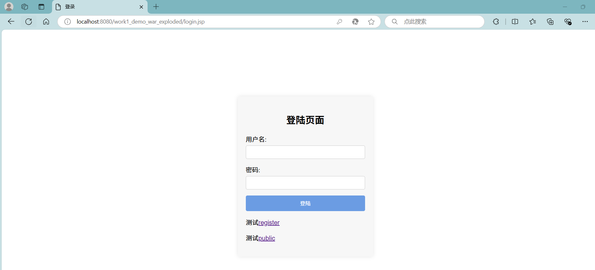
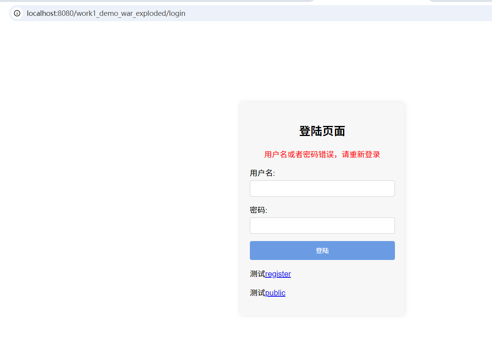

# **作业一：Filter练习**

**题目:** 实现一个登录验证过滤器

**目标:** 创建一个 Servlet的 过滤器,用于验证用户是否已登录。对于未登录的用户,将其**重定向**到登录页面。

**要求:**

1. 创建一个名为 `LoginFilter` 的类, 实现 `javax.servlet.Filter` 接口。
2. 使用 `@WebFilter` 注解配置过滤器,使其应用于所有 URL 路径 ("/\*")。
3. 在 `doFilter` 方法中实现以下逻辑:

   a.检查当前请求是否是对登录页面、注册页面或公共资源的请求。如果是,则允许请求通过。

   b.如果不是上述情况,检查用户的 session 中是否存在表示已登录的属性(如 "user" 属性)。

   c.如果用户已登录,允许请求继续。

   d.如果用户未登录,将请求重定向到登录页面。
4. 创建一个排除列表,包含不需要登录就能访问的路径(如 "/login", "/register", "/public")。
5. 实现一个方法来检查当前请求路径是否在排除列表中。
6. 添加适当的注释,解释代码的主要部分。

### 一、按照题目要求，创建目录

先创建work1-demo的项目，在项目下面创建所需目录，如图所示：


### 二、代码实现

1.LoginFilter.java代码如下：

```
package gzu.com.work1demo;

import jakarta.servlet.*;
import jakarta.servlet.annotation.WebFilter;
import jakarta.servlet.http.HttpServletRequest;
import jakarta.servlet.http.HttpServletResponse;
import jakarta.servlet.http.HttpSession;

import java.io.IOException;
import java.util.Arrays;
import java.util.List;
import java.util.logging.Logger;

@WebFilter(urlPatterns = "/*")
public class LoginFilter implements Filter {

    private List<String> excludePaths;
    private static final Logger LOGGER = Logger.getLogger(LoginFilter.class.getName());

    public void init(FilterConfig filterConfig) throws ServletException {
        // 初始化排除列表
        excludePaths = Arrays.asList("/login", "/register","/public");
    }

    public void doFilter(ServletRequest request, ServletResponse response, FilterChain chain) throws IOException, ServletException {
        HttpServletRequest req = (HttpServletRequest) request;
        HttpServletResponse res = (HttpServletResponse) response;

        // 获取完整的请求路径
        String path = req.getRequestURI();
        String contextPath = req.getContextPath();

        // 检查当前请求路径是否在排除列表中
        if (isExcluded(path, contextPath)) {
            chain.doFilter(request, response);
        } else {
            HttpSession session = req.getSession(false);
            if (session != null && session.getAttribute("user") != null) {
                // 用户已登录，继续请求
                chain.doFilter(request, response);
            } else {
                // 用户未登录，重定向到登录页面
                res.sendRedirect(res.encodeRedirectURL(contextPath + "/login.jsp"));
            }
        }
    }

    private boolean isExcluded(String path, String contextPath) {
        // 检查当前请求路径是否在排除列表中
        return excludePaths.stream().anyMatch(p -> path.startsWith(contextPath + p));
    }

    public void destroy() {
    }
}
```

2.LoginServlet.java代码如下：

```
package gzu.com.work1demo;

import jakarta.servlet.ServletException;
import jakarta.servlet.annotation.WebServlet;
import jakarta.servlet.http.HttpServlet;
import jakarta.servlet.http.HttpServletRequest;
import jakarta.servlet.http.HttpServletResponse;
import jakarta.servlet.http.HttpSession;

import java.io.IOException;

@WebServlet("/login") // 定义Servlet的访问URL
public class LoginServlet extends HttpServlet {
    @Override
    protected void doPost(HttpServletRequest req, HttpServletResponse resp) throws ServletException, IOException {
        // 获取表单数据
        String username = req.getParameter("username");
        String password = req.getParameter("password");

        // 登录验证逻辑
        if ("ljm".equals(username) && "123".equals(password)) {
            // 登录成功，将用户信息存储在session中
            HttpSession session = req.getSession();
            session.setAttribute("user", username);

            // 重定向到index.jsp页面
            resp.sendRedirect(req.getContextPath() + "/index.jsp");
        } else {
            // 登录失败，设置错误消息
            req.setAttribute("errorMessage", "用户名或者密码错误，请重新登录");
            // 转发回登录页面，显示错误消息
            req.getRequestDispatcher("/login.jsp").forward(req, resp);
        }
    }

    @Override
    protected void doGet(HttpServletRequest request, HttpServletResponse response) throws ServletException, IOException {
        // 对于GET请求，转发到登录页面
        request.getRequestDispatcher("/login.jsp").forward(request, response);
    }
}
```

3.login.jsp代码如下：

```
<%--
  Created by IntelliJ IDEA.
  User: xiaolu
  Date: 2024/9/26
  Time: 下午6:16
  To change this template use File | Settings | File Templates.
--%>
<%@ page contentType="text/html; charset=UTF-8" pageEncoding="UTF-8" %>
<!DOCTYPE html>
<html>
<head>
    <title>登录</title>
    <style>
        body, html {
            height: 100%;
            margin: 0;
            display: flex;
            justify-content: center;
            align-items: center;
            font-family: Arial, sans-serif;
        }
        .login-container {
            width: 300px;
            padding: 20px;
            box-shadow: 0 0 10px rgba(0, 0, 0, 0.1);
            border-radius: 5px;
            background: #f7f7f7;
        }
        .login-container h2 {
            text-align: center;
            margin-bottom: 20px;
        }
        .login-container .error-message {
            text-align: center;
            color: red;
            margin-bottom: 15px;
        }
        .login-container form div {
            margin-bottom: 15px;
        }
        .login-container label {
            display: block;
            margin-bottom: 5px;
        }
        .login-container input[type="text"],
        .login-container input[type="password"] {
            width: 100%;
            padding: 8px;
            border: 1px solid #ccc;
            border-radius: 4px;
            box-sizing: border-box;
        }
        .login-container button {
            width: 100%;
            padding: 10px;
            border: none;
            border-radius: 4px;
            background-color: #6b9ce3;
            color: white;
            cursor: pointer;
        }
        .login-container button:hover {
            background-color: #1862bf;
        }
    </style>
</head>
<body>
<div class="login-container">
    <h2>登陆页面</h2>
    <% if (request.getAttribute("errorMessage") != null) { %>
    <p class="error-message"><%= request.getAttribute("errorMessage") %></p>
    <% } %>
    <form action="login" method="post">
        <div>
            <label for="username">用户名:</label>
            <input type="text" id="username" name="username" required>
        </div>
        <div>
            <label for="password">密码:</label>
            <input type="password" id="password" name="password" required>
        </div>
        <div>
            <button type="submit">登陆</button>
        </div>
    </form>
    <p>测试<a href="register.jsp">register</a></p>
    <p>测试<a href="public.jsp">public</a></p>
</div>
</body>
</html>
```

4.public.jsp是为了测试不用登录也能直接访问，代码如下：

```
<%@ page contentType="text/html; charset=UTF-8" pageEncoding="UTF-8" %>
<!DOCTYPE html>
<html>
<head>
    <title>JSP - Hello World</title>
</head>
<body>
<h1><%= "Hello World!" %></h1>
<br/>
<a href="hello-servlet">public测试</a>
</body>
</html>
```

5.register.jsp同pubilc.jsp,代码如下：

```
<%@ page contentType="text/html; charset=UTF-8" pageEncoding="UTF-8" %>
<!DOCTYPE html>
<html>
<head>
    <title>JSP - Hello World</title>
</head>
<body>
<h1><%= "Hello World!" %></h1>
<br/>
<a href="hello-servlet">register测试</a>
</body>
</html>
```

### 三、功能实现

未登录的用户重定向到登录页面，重启服务器跳转到login.jsp,发现不能直接访问index.jsp，登录后可访问index.jsp文件。



输入用户名：ljm和密码：123登录到index.jsp界面。


输入错误的用户名和密码无法登录，需要修改信息重新登录。



当成功登录之后，浏览器cookie以及记录了登录信息，重新打开一个网页直接访问index.jsp，发现能直接访问。


最后目标要求已经完成。
