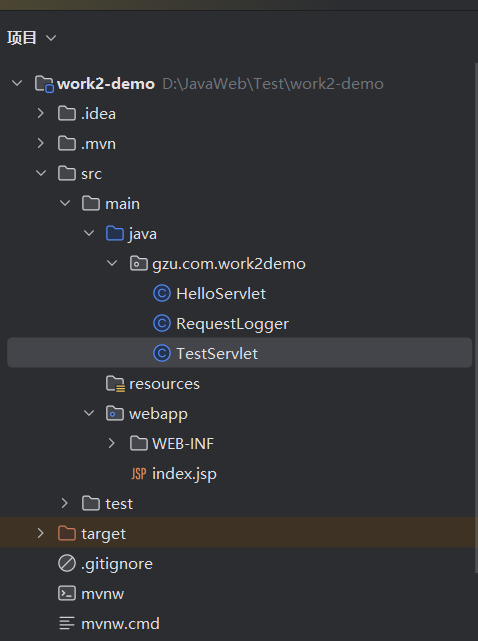
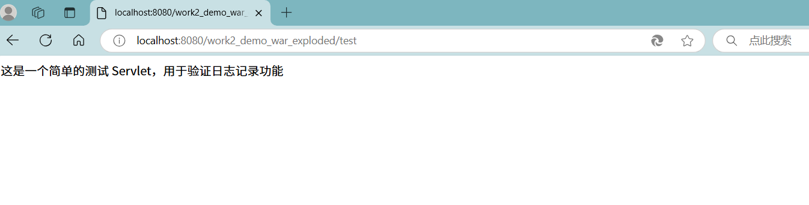
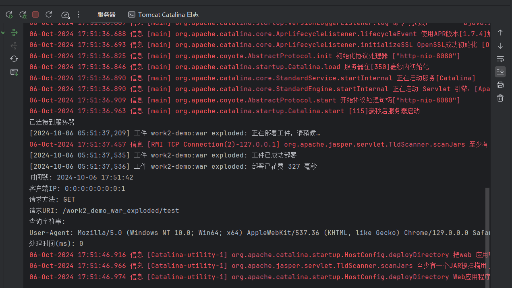

# **作业二：Listener练习**

题目：完成请求日志记录（ServletRequestListener）功能

**要求：**

1. 实现一个 ServletRequestListener 来记录每个 HTTP 请求的详细信息。
2. 记录的信息应包括但不限于：

* 请求时间
* 客户端 IP 地址
* 请求方法（GET, POST 等）
* 请求 URI
* 查询字符串（如果有）
* User-Agent
* 请求处理时间（从请求开始到结束的时间）

3. 在请求开始时记录开始时间，在请求结束时计算处理时间。
4. 使用适当的日志格式，确保日志易于阅读和分析。
5. 实现一个简单的测试 Servlet，用于验证日志记录功能。
6. 提供简要说明，解释你的实现方式和任何需要注意的事项。

### 一、创建项目

创建work2-demo的项目，创建题目所需目录，如图所示：



### 二、代码实现

1.`RequestLogger` 是一个用于记录 HTTP 请求详细信息的监听器。

```
package gzu.com.work2demo;

import jakarta.servlet.ServletRequestEvent;
import jakarta.servlet.ServletRequestListener;
import jakarta.servlet.annotation.WebListener;
import jakarta.servlet.http.HttpServletRequest;
import java.text.SimpleDateFormat;
import java.util.Date;

@WebListener
public class RequestLogger implements ServletRequestListener {

    private static final SimpleDateFormat DATE_FORMAT = new SimpleDateFormat("yyyy-MM-dd HH:mm:ss");

    @Override
    public void requestDestroyed(ServletRequestEvent sre) {
        long endTime = System.currentTimeMillis();
        long processingTime = endTime - (Long) sre.getServletRequest().getAttribute("startTime");
        logRequestDetails(sre, endTime, processingTime);
    }

    @Override
    public void requestInitialized(ServletRequestEvent sre) {
        sre.getServletRequest().setAttribute("startTime", System.currentTimeMillis());
    }

    private void logRequestDetails(ServletRequestEvent sre, long endTime, long processingTime) {
        var request = sre.getServletRequest();
        HttpServletRequest httpRequest = (HttpServletRequest) request;

        // 只记录对 /test 路径的请求
        if (!httpRequest.getRequestURI().endsWith("/test")) {
            return;
        }

        String timestamp = DATE_FORMAT.format(new Date(endTime));
        String remoteAddr = httpRequest.getRemoteAddr();
        String method = httpRequest.getMethod();
        String uri = httpRequest.getRequestURI();
        String query = httpRequest.getQueryString() != null ? httpRequest.getQueryString() : "";
        String userAgent = httpRequest.getHeader("User-Agent");
        String processingTimeMs = String.valueOf(processingTime);

        // 使用 System.out.println 打印日志
        System.out.println("时间戳: " + timestamp);
        System.out.println("客户端IP: " + remoteAddr);
        System.out.println("请求方法: " + method);
        System.out.println("请求URI: " + uri);
        System.out.println("查询字符串: " + query);
        System.out.println("User-Agent: " + userAgent);
        System.out.println("处理时间(ms): " + processingTimeMs);
    }
}
```

**实现方式**：

1. **@WebListener** 注解：标记这个类为一个监听器，使得 Servlet 容器在启动时能够自动注册它。
2. **requestInitialized 方法**：在请求初始化时被调用，记录请求开始的时间。
3. **requestDestroyed 方法**：在请求销毁时被调用，计算请求的处理时间，并记录请求的详细信息。
4. **logRequestDetails 方法**：打印请求的详细信息，包括时间戳、客户端 IP、请求方法、请求 URI、查询字符串、User-Agent 和处理时间。

**注意事项**：

* 日志记录使用了 `System.out.println`，这在生产环境中可能不是最佳实践。
* 当前实现只记录请求 URI 以 `/test` 结尾的请求。

2.`TestServlet` 是一个简单的 Servlet，用于处理对 `/test` 路径的 GET 和 POST 请求。

```
package gzu.com.work2demo;


import jakarta.servlet.ServletException;
import jakarta.servlet.annotation.WebServlet;
import jakarta.servlet.http.HttpServlet;
import jakarta.servlet.http.HttpServletRequest;
import jakarta.servlet.http.HttpServletResponse;
import java.io.IOException;
import java.io.PrintWriter;

@WebServlet("/test")
public class TestServlet extends HttpServlet {
    @Override
    public void doGet(HttpServletRequest req, HttpServletResponse resp) throws ServletException, IOException {
        resp.setCharacterEncoding("UTF-8");
        resp.setContentType("text/html;charset=UTF-8");
        PrintWriter out = resp.getWriter();
        out.println("这是一个简单的测试 Servlet，用于验证日志记录功能");
    }
    public void doPost(HttpServletRequest req, HttpServletResponse resp) throws ServletException, IOException {
        doGet(req, resp);
    }
}
```

**实现方式**：

1. **@WebServlet("/test")** 注解：将这个 Servlet 映射到 `/test` 路径。
2. **doGet 方法**：处理 GET 请求，设置响应的字符编码和内容类型，并输出简单的 HTML 文本。
3. **doPost 方法**：处理 POST 请求，调用 doGet 方法，实现与 GET 请求相同的处理逻辑。

**注意事项**：

* 响应设置了字符编码和内容类型为 UTF-8，以确保正确处理和显示中文。
* 使用 `PrintWriter` 输出响应内容。
* 对于简单的测试，GET 和 POST 请求的处理逻辑相同，因此 POST 请求的处理被委托给了 doGet 方法。

### 三、功能实现

1.重启服务器，访问`http://localhost:8080/work2_demo_war_exploded/test`



2.返回查看服务器记录的日志



显然所需的功能已经实现。
